# Decentralized Finance (DeFi) Lending System

The project introduces a **Decentralized Finance (DeFi) Lending Platform** that removes intermediaries like banks and enables direct **peer-to-peer lending, borrowing, and investing** using blockchain technology.  

The system combines **Ethereum smart contracts, Web3 wallet integration, and AI-driven assistance** to create a transparent, secure, and user-friendly platform.

### Key Features
- ✅ **Smart Contracts** (Solidity + Hardhat) – Automating lending, borrowing, and collateral management.  
- ✅ **Frontend (React.js + Tailwind CSS)** – Modern, responsive UI with wallet integration.  
- ✅ **Backend (Node.js + Express.js)** – REST APIs for user authentication and loan management.  
- ✅ **Database (MongoDB + IPFS)** – Hybrid storage for user and transaction records.  
- ✅ **MetaMask Integration** – Seamless Ethereum wallet connectivity.  
- ✅ **NFT Rewards** – Gamified participation using tokenized incentives.  
- ✅ **AI Chatbot** – Assisting users with platform navigation and DeFi concepts in real time.  
- ✅ **Chainlink Oracles** – Real-time crypto price feeds to calculate loan amounts and trigger liquidations.  

---

## 🔍 Problem Statement
Traditional banking systems:
- Impose **high fees** and **long processing times**.  
- Exclude individuals without formal credit history.  
- Rely on centralized control, making them prone to fraud and systemic risks.  

**DeFi Lending System** addresses these issues by providing:
- Direct **peer-to-peer lending** without intermediaries.  
- **Faster, transparent, and borderless** transactions.  
- **Inclusive financial access** for underbanked and marginalized communities.  

---

## 🎯 Objectives
1. Establish a transparent and decentralized financial ecosystem.  
2. Facilitate **peer-to-peer lending & borrowing** of assets without intermediaries.  
3. Enhance inclusivity by lowering costs and making finance accessible to all.  
4. Provide a gamified trust system using **NFT rewards** and **community-driven risk assessment**.  
5. Ensure system reliability through **smart contract audits** and decentralized identity checks.  

---

## ⚙️ System Architecture

### 🔹 Frontend
- React.js + Vite + Tailwind CSS  
- Wallet connection (MetaMask)  
- Components: Deposit, Borrow, Pay Loan, Invest, Dashboard, NFT Management  

### 🔹 Backend
- Node.js + Express.js REST APIs  
- JWT Authentication & Authorization  
- MongoDB for storing users and investments  

### 🔹 Smart Contracts
- Solidity contracts for lending, borrowing, collateral, and NFT rewards  
- Hardhat for testing & deployment on Ethereum testnets (Goerli, Sepolia)  

### 🔹 Additional Integrations
- **Chainlink** for oracle price feeds  
- **IPFS** for decentralized file storage  
- **AI Chatbot** for user onboarding & support  

---

## 🚀 Unique Contributions
- **Community-Driven Risk Assessment** – Borrower credibility determined through peer-based trust scores.  
- **Social Capital as Collateral** – First-of-its-kind DeFi approach using endorsements and community trust.  
- **Gamified Trust Economy** – Maintaining borrower trust scores with NFT-based incentives.  
- **Sybil Resistance** – Using **Gitcoin Passport** for decentralized identity verification.  

---

## 🛠️ Tools & Technologies
- **Blockchain**: Ethereum  
- **Smart Contracts**: Solidity, Hardhat  
- **Frontend**: React.js, Tailwind CSS, Framer Motion  
- **Backend**: Node.js, Express.js  
- **Database**: MongoDB, IPFS  
- **Wallets**: MetaMask, ethers.js  
- **Oracles**: Chainlink  
- **Cloud**: AWS / Infura / Alchemy  

---

## 🛤️ Roadmap
1. **Collateralized Lending** – Borrowers lock up crypto as collateral.  
2. **Dynamic Interest Rates** – Based on borrowing demand.  
3. **Automatic Liquidation** – Collateral sold if it falls below threshold.  
4. **Decentralized Identity Check** – Preventing fake accounts using Gitcoin Passport.  
5. **Smart Contract Audits** – Regular security checks to prevent exploits.  

---

## 🌍 Benefits / Social Contribution
- Promotes **financial inclusion** by lowering barriers for underbanked populations.  
- Encourages **responsible borrowing** through community-driven trust scores.  
- Creates a **transparent and borderless** lending marketplace.  
- Offers **passive income opportunities** for users via lending pools.  

## 📸 Screenshots

Below are some UI snapshots of the DeFi Lending System:

### 🔑 Authentication
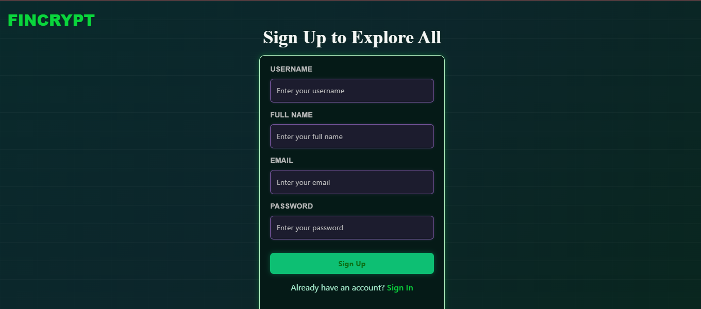  
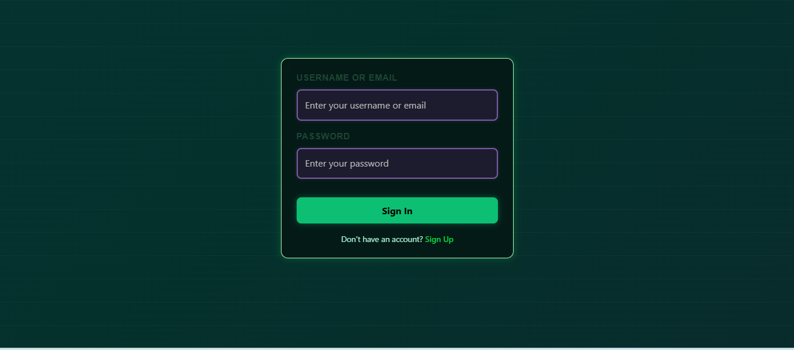  

### 🤖 AI Assistant
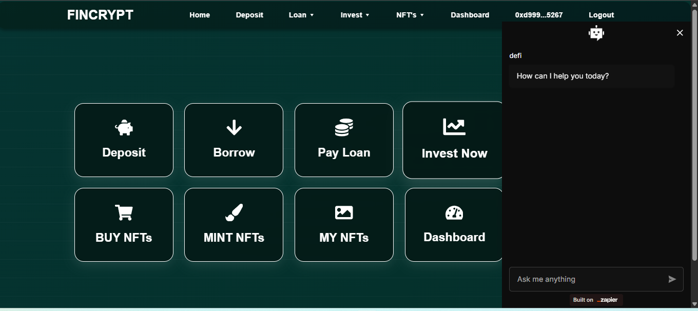  

### 💰 Lending & Deposits
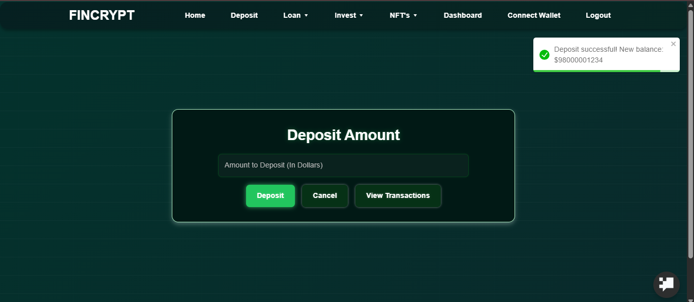  
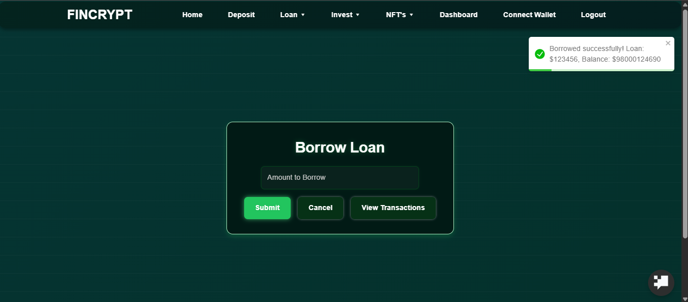  

### 🔗 Wallet Integration
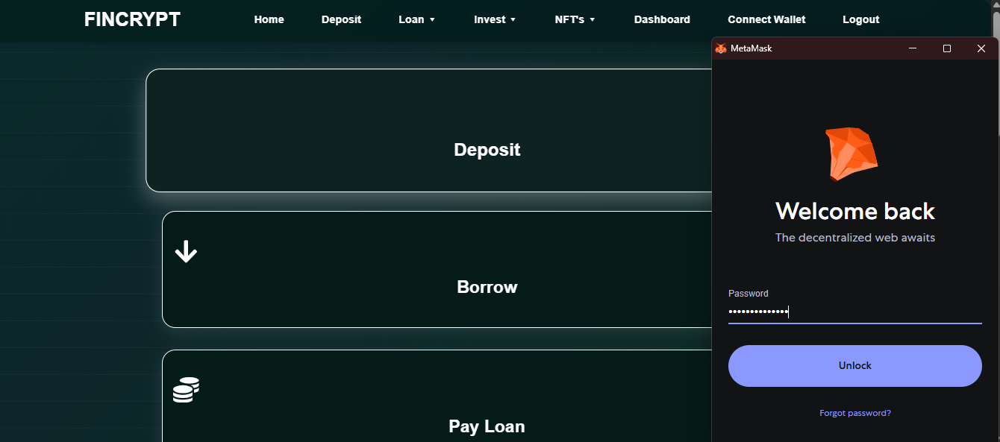  
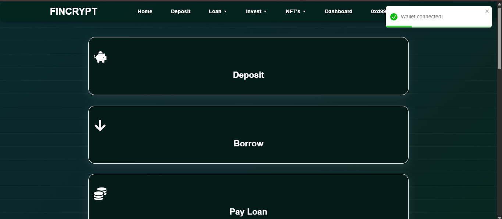  

### 💵 Transactions
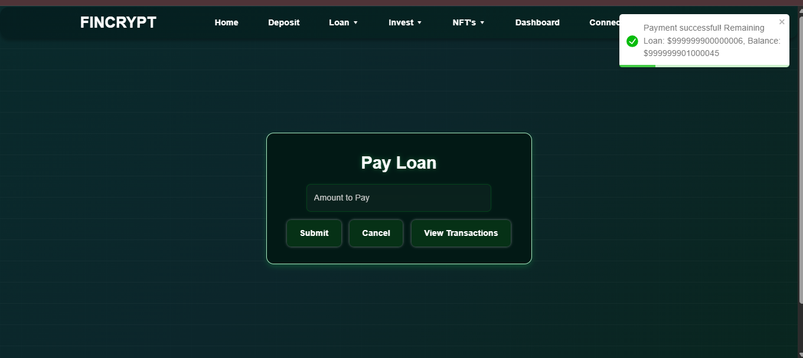  
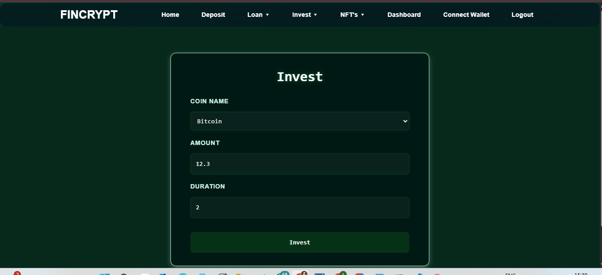  

### 🖼️ NFT Trades
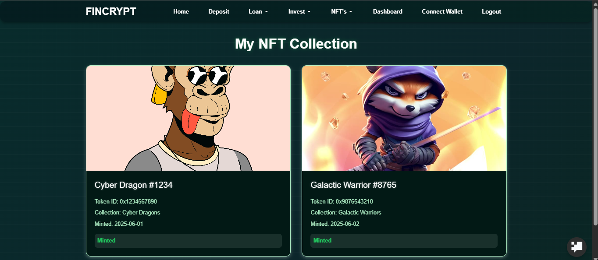  

### 📊 Reports
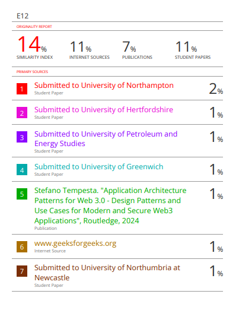  
